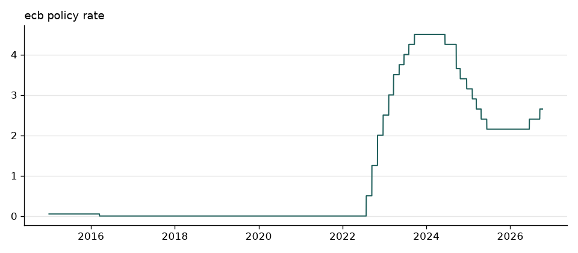
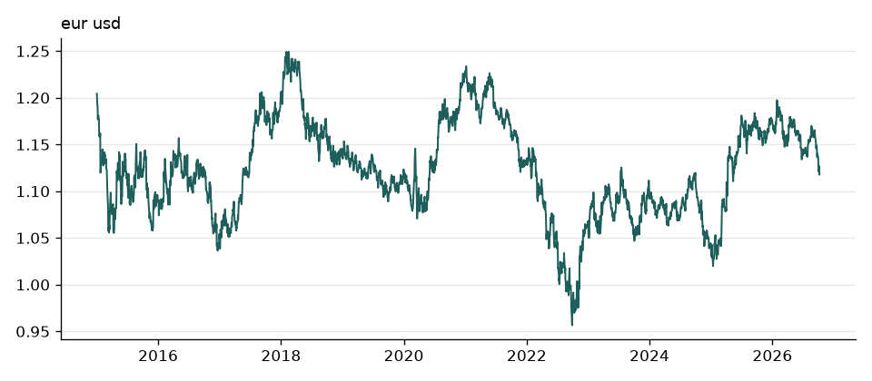
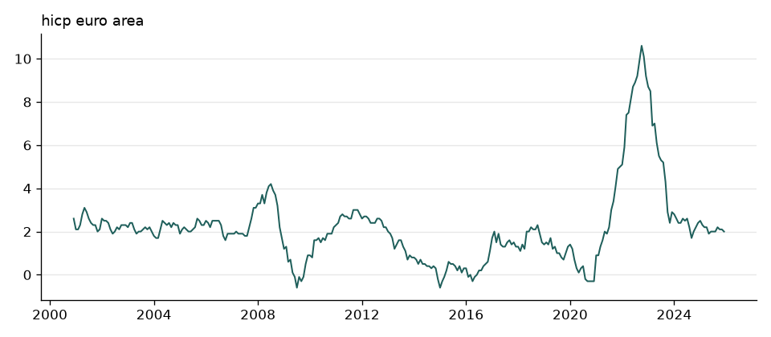
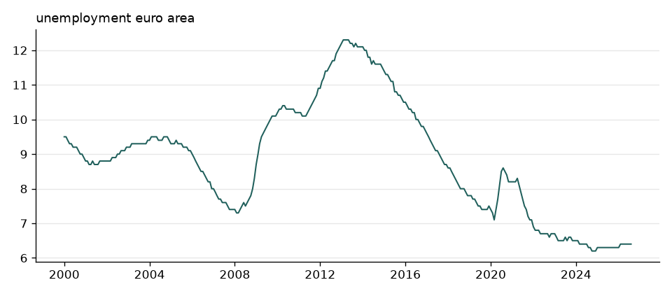
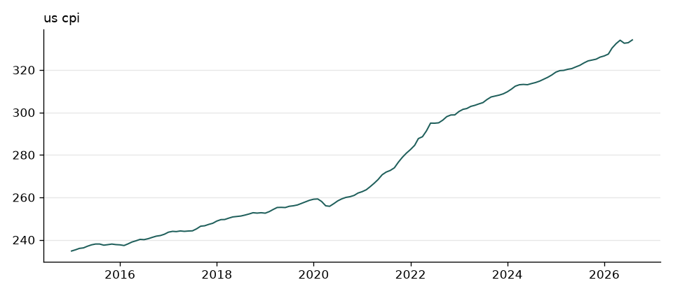
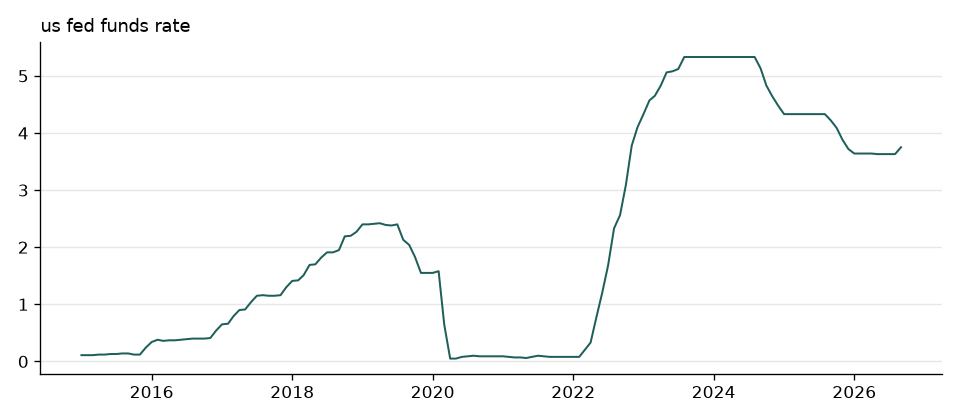

# Euro Area Macro Monitor

Automated ETL pipeline collecting macro and financial indicators from the
ECB Data Portal, Eurostat, and FRED. Runs daily via GitHub Actions.

**Last updated:** 2026-10-09 12:29 UTC
**Observations stored:** 8,214

## Indicators

| Series | Source | Frequency | Latest date | Latest value |
|---|---|---|---|---|
| `ecb_policy_rate` | ecb | daily | 2026-10-09 | 2.65 |
| `eur_usd` | ecb | daily | 2026-10-08 | 1.119 |
| `hicp_euro_area` | eurostat | monthly | 2025-12-01 | 2 |
| `unemployment_euro_area` | eurostat | monthly | 2026-08-01 | 6.4 |
| `us_cpi` | fred | monthly | 2026-08-01 | 334.1 |
| `us_fed_funds_rate` | fred | monthly | 2026-09-01 | 3.75 |

Note on coverage: `hicp_euro_area` uses the EA20 aggregate (20 countries) while
`unemployment_euro_area` uses EA21 (21 countries). Eurostat does not update
area codes across all datasets simultaneously, so the two series do not cover
an identical population.

## How it works
APIs -> fetch -> Parquet (data/processed/) -> DuckDB queries -> charts


- `src/monitor/config.py` — which indicators to collect
- `src/monitor/sources/` — one module per API
- `src/monitor/pipeline.py` — fetch and combine
- `src/monitor/storage.py` — Parquet store with incremental loading
- `.github/workflows/daily-update.yml` — daily scheduled run

Each observation carries a `vintage_date` recording when that figure was first
published, so later revisions do not silently rewrite history.

## Running it yourself

```bash
python -m venv .venv
source .venv/Scripts/activate      # Windows; use .venv/bin/activate elsewhere
pip install -r requirements.txt
pip install -e .

cp .env.example .env               # then add your free FRED API key
python scripts/run_pipeline.py
python scripts/make_charts.py
```

A FRED API key is free from https://fredaccount.stlouisfed.org/apikeys
The ECB and Eurostat sources need no key.

## Charts

### ecb policy rate



### eur usd



### hicp euro area



### unemployment euro area



### us cpi



### us fed funds rate



## Development log

See [docs/setup-log.md](docs/setup-log.md) for the build history, design
decisions, and problems encountered.
